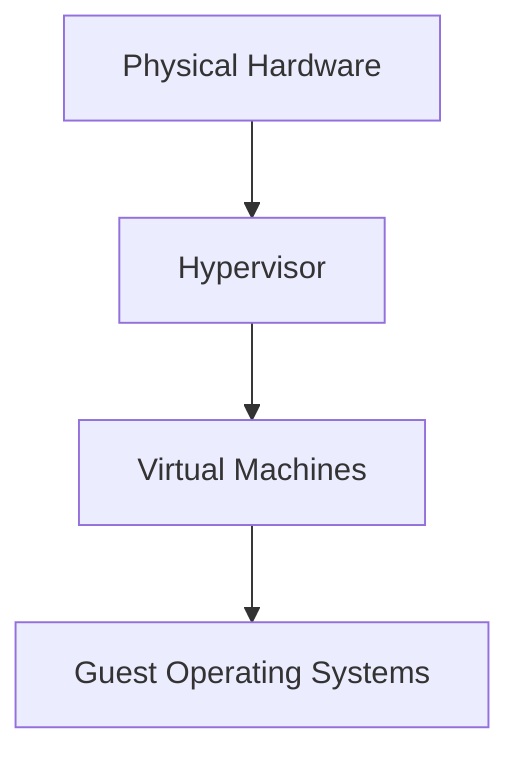
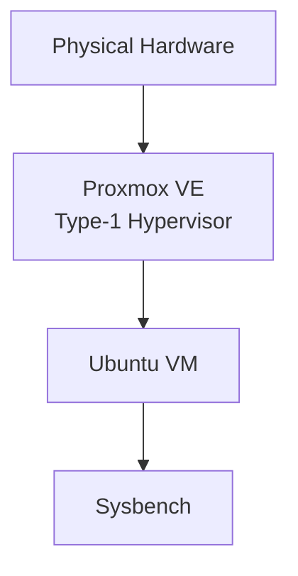
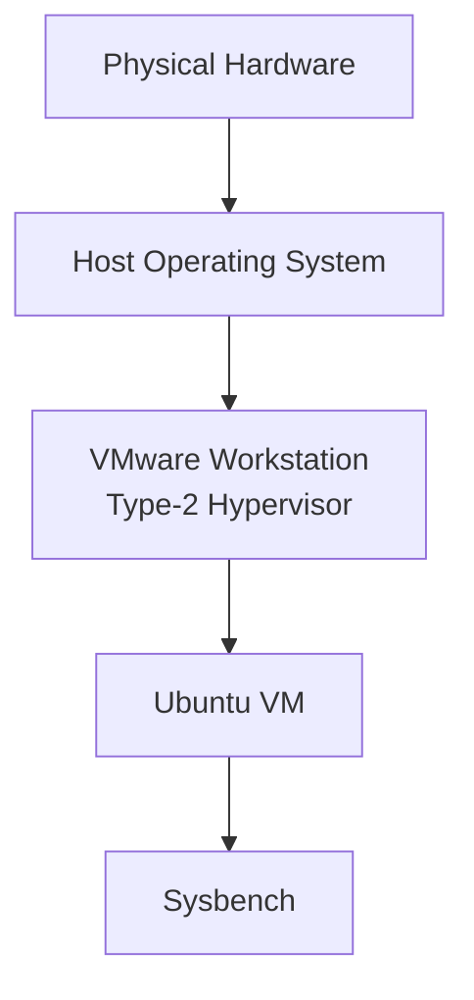
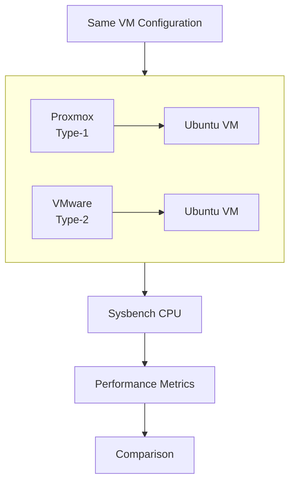
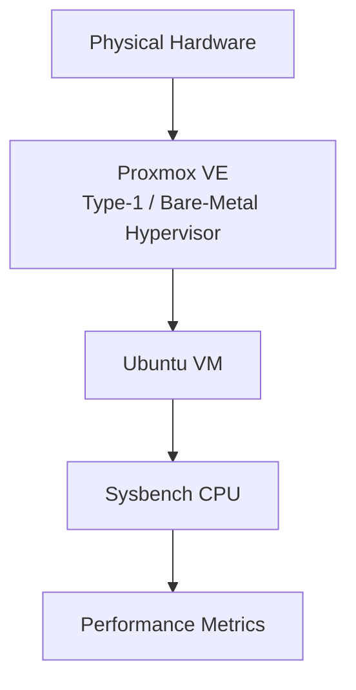
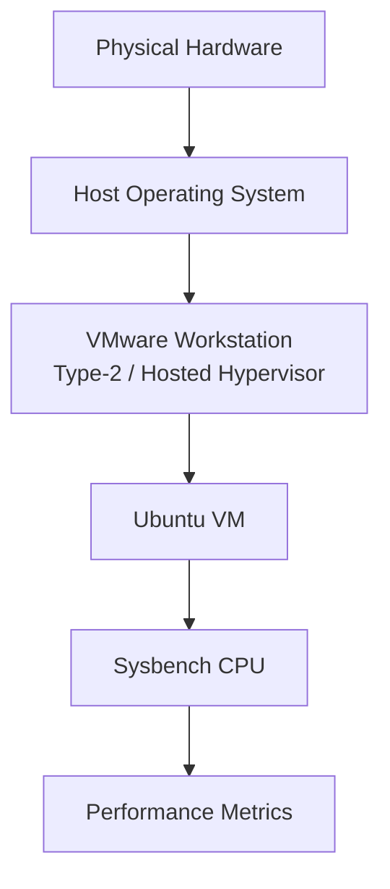

# EXPERIMENT – 01
## Performance Analysis of Type-1 and Type-2 Hypervisors
### Proxmox VE vs VMware Workstation using Sysbench

- **Subject:** Cloud Computing
- **Experiment Number:** 01
- **Benchmark:** Sysbench CPU
- **Guest OS:** Ubuntu

This experiment analyzes and compares the computational performance of virtual machines deployed on bare-metal (Type-1) and hosted (Type-2) hypervisors. We will utilize the Sysbench CPU benchmark on identical Ubuntu guest configurations to evaluate and contrast the execution time, throughput, and latency characteristics in both Proxmox VE and VMware Workstation environments.

## 2. Aim

To analyze and compare the CPU performance of Ubuntu virtual machines running on a Type-1 hypervisor (Proxmox VE) and a Type-2 hypervisor (VMware Workstation) using the Sysbench CPU benchmark under similar virtual machine configurations.

## 3. Objectives

1. Understand virtualization and hypervisor concepts.
2. Study Type-1 and Type-2 hypervisor architectures.
3. Configure an Ubuntu VM using Proxmox VE.
4. Configure an Ubuntu VM using VMware Workstation.
5. Maintain similar VM resources in both environments.
6. Install and configure Sysbench.
7. Execute the same CPU benchmark on both VMs.
8. Record execution time, throughput, and latency.
9. Compare the measured performance.
10. Represent the results using graphs.

## 4. Theory

### 4.1 Virtualization

Virtualization is a technology that allows creating multiple simulated environments or dedicated resources from a single, physical hardware system. This is achieved by abstracting the physical hardware (CPU, memory, storage, and network) to create multiple logical resources called Virtual Machines (VMs). Each VM operates independently and runs its own Guest Operating System, entirely isolated from other VMs residing on the same Host system.



### 4.2 Hypervisor

A hypervisor (or Virtual Machine Monitor - VMM) is software, firmware, or hardware that creates, manages, and runs virtual machines.
- **Purpose:** To abstract and isolate operating systems and applications from the underlying physical computer hardware.
- **Resource Management:** It actively allocates computing resources (such as CPU time and RAM) among the virtual machines.
- **VM Isolation:** It ensures that virtual machines are entirely logically separated; a crash in one VM does not affect the others.
- **CPU & Memory Allocation:** It dynamically distributes physical CPU cores and RAM to the virtual machines according to their configured parameters.

Hypervisors are fundamentally categorized into two types: Type-1 and Type-2.

### 4.3 Type-1 Hypervisor

A Type-1 or Bare-Metal Hypervisor runs directly on the host's physical hardware to manage guest operating systems.
- Runs directly on physical hardware.
- Does not require a conventional host OS underneath.
- Manages VM resources with minimal overhead, providing better performance and stability.
- Commonly used in server environments and enterprise data centers.

**Example:** Proxmox VE.



### 4.4 Type-2 Hypervisor

A Type-2 or Hosted Hypervisor runs as a software layer on top of a conventional operating system.
- Runs on a host operating system.
- Host OS manages the physical hardware resources.
- Hypervisor provides virtualization capabilities by requesting resources from the host OS.
- Commonly used on desktop/laptop systems for development, testing, and learning.

**Example:** VMware Workstation.



### 4.5 Type-1 vs Type-2

| Feature | Type-1 | Type-2 |
|---|---|---|
| Architecture | Bare-metal | Hosted |
| Runs on | Physical hardware | Host OS |
| Host OS dependency | No conventional host OS | Yes |
| Example | Proxmox VE | VMware Workstation |
| Typical usage | Servers | Desktop / Development |
| Resource access | More direct | Through host OS |

### 4.6 Proxmox VE

Proxmox Virtual Environment (Proxmox VE) is an open-source server management platform for enterprise virtualization. It tightly integrates KVM hypervisor (Type-1 virtualization) and Linux Containers (LXC). It provides an intuitive web interface for managing VMs, allowing precise configuration of CPU, memory, storage, and networking resources, along with built-in monitoring tools.

### 4.7 VMware Workstation

VMware Workstation is a widely used Type-2 hypervisor that enables users to run multiple virtual machines concurrently on a single physical host machine. It relies on the underlying host operating system for hardware interaction while offering an easy-to-use graphical interface for VM creation, network configuration, storage allocation, and flexible CPU and memory provisioning.

### 4.8 Sysbench

Sysbench is a scriptable multi-threaded benchmark tool based on LuaJIT. It is heavily used for CPU benchmarking to calculate prime numbers, effectively stress-testing the virtualized CPU and measuring latency, execution speed, and event processing capabilities.

```bash
sysbench cpu --cpu-max-prime=20000 run
```

## 5. Requirements

**Hardware Requirements**

| Component | Requirement |
|---|---|
| Host Computer | Required |
| Virtualization-enabled CPU | Required |
| RAM | Sufficient for VM execution |
| Storage | Sufficient for VM |
| Network | Required |

**Software Requirements**

| Software | Purpose |
|---|---|
| Proxmox VE | Type-1 Hypervisor |
| VMware Workstation | Type-2 Hypervisor |
| Ubuntu | Guest OS |
| Sysbench | CPU Benchmark |
| Git / GitHub | Documentation |

## 6. Experimental Configuration

To ensure a fair and accurate comparison, both virtual machines use completely equivalent computational resources.

| Parameter | Configuration |
|---|---|
| Guest OS | Ubuntu |
| CPU | 2 vCPU |
| RAM | 2 GB |
| Disk | 20 GB |
| Benchmark | Sysbench CPU |
| CPU Workload | `--cpu-max-prime=20000` |



## 7. Procedure

### 7.1 VM Configuration

For both hypervisor platforms, a virtual machine must be created and configured with the exact same specifications: Ubuntu guest OS, 2 vCPUs, 2 GB of RAM, and a 20 GB virtual disk.

### 7.2 System Verification

Verify the system configurations in both VMs using the following terminal commands:
- `hostnamectl` : Displays the system hostname and underlying OS details.
- `lscpu` : Displays detailed information about the CPU architecture and allocated cores.
- `free -h` : Shows the total, used, and available RAM in a human-readable format.
- `df -h` : Reports the available and used disk space on the file system.
- `top` : Displays real-time system resource utilization (CPU, memory) and running processes.

### 7.3 Install Sysbench

Install the benchmarking tool on both virtual machines:
```bash
sudo apt update
sudo apt install sysbench -y
```

Verify the installation:
```bash
sysbench --version
```

### 7.4 Benchmark

Execute the Sysbench CPU test. The SAME benchmark command must be used in Part A and Part B.
```bash
sysbench cpu --cpu-max-prime=20000 run
```

## 8. Part A – Type-1 Hypervisor: Proxmox VE

### 8.1 Part A Architecture


**VM Configuration:** CPU: 2 vCPU | RAM: 2 GB | Disk: 20 GB | OS: Ubuntu

### 8.2 Accessing Proxmox VE

Access the management interface via web browser:
`https://<PROXMOX_SERVER_IP>:8006`

### 8.3 VM Creation

1. Open Proxmox VE web interface.
2. Select **Create VM** from the top menu.
3. Configure **General** settings.
4. Select the **Ubuntu ISO** in the OS tab.
5. Configure **System** settings.
6. Configure **Storage** (Set disk size to 20 GB).
7. Configure **CPU** (Set to 2 vCPUs).
8. Configure **Memory** (Set to 2048 MB).
9. Configure **Network**.
10. Review the summary and create.

### 8.4 VM Configuration

| Parameter | Value |
|---|---|
| Hypervisor | Proxmox VE |
| Type | Type-1 |
| Guest OS | Ubuntu |
| CPU | 2 vCPU |
| RAM | 2048 MB |
| Disk | 20 GB |
| Network | vmbr0 |

### 8.5 Ubuntu Installation

Start the VM and follow the standard Ubuntu installation wizard. Complete the setup and reboot the virtual machine.

### 8.6 System Verification

```bash
hostnamectl
lscpu
free -h
df -h
top
```

### 8.7 Sysbench Installation

```bash
sudo apt update
sudo apt install sysbench -y
```

Verify:
```bash
sysbench --version
```

### 8.8 Benchmark Execution

```bash
sysbench cpu --cpu-max-prime=20000 run
```

### 8.9 Part A Results

| Metric | Proxmox VE |
|---|---|
| Total Execution Time | 10.0005 s |
| Total Events | 17494 |
| Events per Second | 1749.16 |
| Minimum Latency | 0.57 ms |
| Average Latency | 0.57 ms |
| Maximum Latency | 2.43 ms |
| 95th Percentile Latency | 0.58 ms |

### 8.10 Part A Evidence

- Proxmox dashboard
- VM configuration
- VM running
- Ubuntu console
- System configuration
- Sysbench result
- Resource monitoring

**Screenshots location:** `Screenshots/Type-01 proxmox/`

## 9. Part B – Type-2 Hypervisor: VMware Workstation

### 9.1 Part B Architecture


**VM Configuration:** CPU: 2 vCPU | RAM: 2 GB | Disk: 20 GB | OS: Ubuntu

### 9.2 VM Creation

1. Open VMware Workstation.
2. Select **Create New Virtual Machine**.
3. Select **Typical**.
4. Select the **Ubuntu ISO** installer image.
5. Configure **processor**.
6. Configure **memory**.
7. Configure **virtual disk**.
8. Configure **network**.
9. Finish VM creation.

### 9.3 VM Configuration

| Parameter | Value |
|---|---|
| Hypervisor | VMware Workstation |
| Type | Type-2 |
| Guest OS | Ubuntu |
| CPU | 2 vCPU |
| RAM | 2048 MB |
| Disk | 20 GB |
| Network | NAT |

### 9.4 Ubuntu Installation

Power on the virtual machine and proceed with the standard Ubuntu installation prompts. Complete the setup and restart the guest OS.

### 9.5 System Verification

```bash
hostnamectl
lscpu
free -h
df -h
top
```

### 9.6 Sysbench Installation

```bash
sudo apt update
sudo apt install sysbench -y
```

Verify:
```bash
sysbench --version
```

### 9.7 Benchmark Execution

```bash
sysbench cpu --cpu-max-prime=20000 run
```

### 9.8 Part B Results

| Metric | VMware Workstation |
|---|---|
| Total Execution Time | 10.0028 s |
| Total Events | 2713 |
| Events per Second | 271.14 |
| Minimum Latency | 2.06 ms |
| Average Latency | 3.68 ms |
| Maximum Latency | 14.64 ms |
| 95th Percentile Latency | 5.37 ms |

### 9.9 Part B Evidence

- VMware VM configuration
- VM running
- Ubuntu console
- System configuration
- Sysbench result

**Screenshots location:** `Screenshots/Type - 02 VMware/`

## 10. Results

| Metric | Proxmox VE | VMware Workstation |
|---|---|---|
| Total Execution Time | 10.0005 s | 10.0028 s |
| Total Events | 17494 | 2713 |
| Events per Second | 1749.16 | 271.14 |
| Minimum Latency | 0.57 ms | 2.06 ms |
| Average Latency | 0.57 ms | 3.68 ms |
| Maximum Latency | 2.43 ms | 14.64 ms |
| 95th Percentile Latency | 0.58 ms | 5.37 ms |

## 11. Performance Comparison

### 11.1 Total Execution Time
The total time taken to complete the required prime number calculations.

### 11.2 Total Events
The total number of prime number calculation iterations successfully finished during the test period.

### 11.3 Events per Second
The rate of prime number calculations performed per second.

### 11.4 Minimum Latency
The absolute shortest time taken to execute a single event.

### 11.5 Average Latency
The mean time required to process an event across the entire test run.

### 11.6 Maximum Latency
The longest recorded delay for completing a single event.

### 11.7 95th Percentile Latency
The latency threshold under which 95% of all events were completed.

## 12. Graphical Analysis


## 13. Experimental Evidence

Screenshots provide evidence of:
- VM configuration
- VM execution
- System verification
- Sysbench benchmark
- Resource monitoring
- Final comparison

```
Screenshots/
├── Comparison/
├── Type - 02 VMware/
└── Type-01 proxmox/
```

## 14. Conclusion

This experiment studies and compares the measured CPU benchmark behavior of Ubuntu VMs running on Proxmox VE (Type-1) and VMware Workstation (Type-2) using the same Sysbench workload.

## 15. Repository Structure

```
CC-Experiment-01-Hypervisor-Analysis/
│
├── README.md
├── LAB_REPORT.md
│
├── Results/
│   └── Performance-analysis.md
│
├── Graphs/
│   ├── events-per-second.png
│   ├── execution-time.png
│   ├── minimum-latency.png
│   ├── average-latency.png
│   ├── maximum-latency.png
│   └── percentile-95.png
│
└── Screenshots/
    ├── Comparison/
    ├── Type - 02 VMware/
    └── Type-01 proxmox/
```

## 16. How to Reproduce

1. Create Ubuntu VM on Proxmox VE.
2. Configure 2 vCPU, 2 GB RAM and 20 GB disk.
3. Verify the system.
4. Install Sysbench.
5. Run the benchmark.
6. Record the results.
7. Create equivalent Ubuntu VM on VMware Workstation.
8. Repeat the same benchmark.
9. Record the results.
10. Compare the results.
11. Generate the graphs.
12. Add screenshots as evidence.
