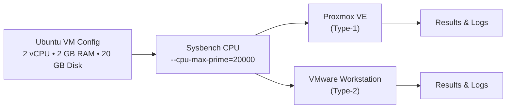
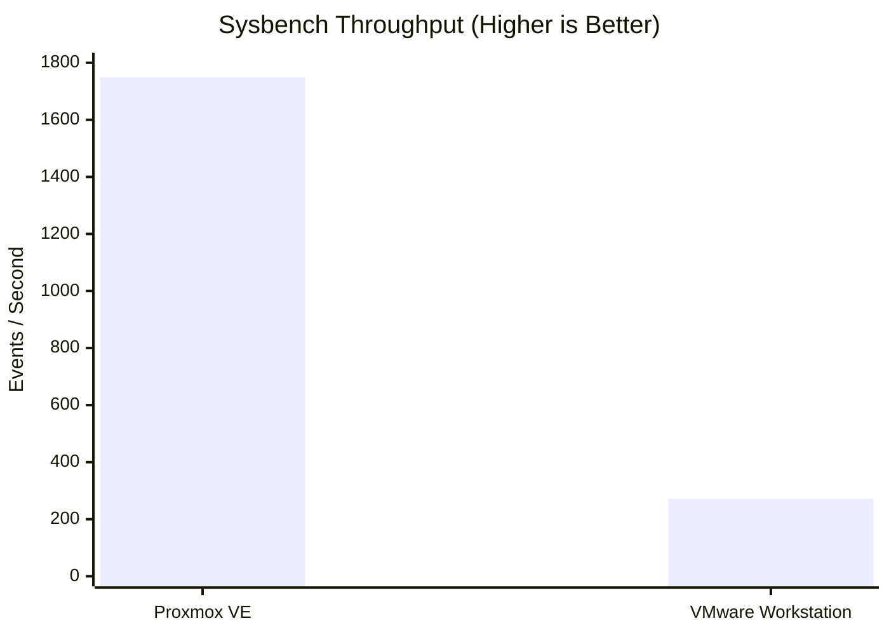
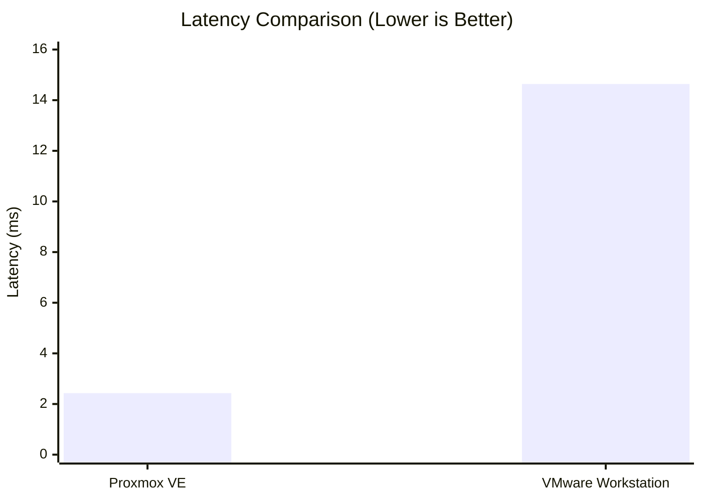

# CC Experiment 01 – Hypervisor Performance Analysis

<p align="center">
  <b>Type-1 vs Type-2 Hypervisor Performance using Sysbench</b><br>
  <sub>Cloud Computing • Ubuntu VM • CPU Benchmarking</sub>
</p>

<p align="center">
  
  
  
  
</p>

---

## 📑 Table of Contents
1. [About the Experiment](#about-the-experiment)
2. [Objective](#objective)
3. [Environment & Setup](#environment--setup)
4. [Benchmark Methodology](#benchmark-methodology)
5. [Experimental Results](#experimental-results)
6. [Performance Comparison & Analysis](#performance-comparison--analysis)
7. [Repository Structure](#repository-structure)
8. [How to Reproduce](#how-to-reproduce)
9. [Conclusion](#conclusion)

---

## 📖 About the Experiment

This Cloud Computing experiment compares the CPU performance of virtual machines running on two fundamentally different hypervisor architectures:

| Hypervisor | Architecture | Description |
|---|---|---|
| **Proxmox VE** | Type-1 Hypervisor | Runs directly on the host's hardware to control the hardware and manage guest operating systems. |
| **VMware Workstation** | Type-2 Hypervisor | Runs as an application on a conventional operating system (host OS). |

The exact same CPU benchmark was executed inside Ubuntu virtual machines configured with identical resource limits. Metrics recorded include execution time, total events, event throughput, and latency.

---

## 🎯 Objective

The objectives of this experiment are to:
1. Provision an Ubuntu virtual machine using a **Type-1 hypervisor**.
2. Provision an Ubuntu virtual machine using a **Type-2 hypervisor**.
3. Enforce consistent virtual-machine hardware allocations across both environments.
4. Execute the **Sysbench CPU benchmark** consistently on both systems.
5. Record execution time, total events, throughput, and latency.
6. Compare and analyze the observed benchmark results.

---

## ⚙️ Environment & Setup

Both virtual machines were strictly configured with the identical base guest resources:

```text
┌──────────────────────────────────────────────┐
│              Ubuntu Virtual Machine          │
├──────────────────────────────────────────────┤
│  CPU       → 2 vCPU                          │
│  RAM       → 2048 MB                         │
│  Disk      → 20 GB                           │
│  Workload  → Sysbench CPU                    │
│  Prime     → 20000                           │
└──────────────────────────────────────────────┘
```

### Tools & Technologies Used
*   **Type-1 Hypervisor:** Proxmox VE
*   **Type-2 Hypervisor:** VMware Workstation
*   **Guest OS:** Ubuntu 24.04 LTS
*   **Benchmark Tool:** Sysbench 1.0.20
*   **CPU Benchmark Command:** `sysbench cpu --cpu-max-prime=20000 run`

### Architecture Flow



---

## 🧪 Benchmark Methodology

The following systematic procedure was executed identically on both hypervisor environments:

1. **System Preparation:** Install necessary packages.
   ```bash
   sudo apt update
   sudo apt install sysbench -y
   ```
2. **Verification:** Ensure correct installation.
   ```bash
   sysbench --version
   ```
3. **Execution:** Run the deterministic CPU benchmark.
   ```bash
   sysbench cpu --cpu-max-prime=20000 run
   ```
4. **Data Collection:** The following metrics were extracted from the Sysbench output:
   * Total execution time
   * Total number of events
   * Events per second (Throughput)
   * Minimum, Average, Maximum, and 95th Percentile Latency

---

## 📊 Experimental Results

### 1. Type-1 Hypervisor (Proxmox VE)
The Proxmox virtual machine was configured natively over the hardware. After verifying the Ubuntu environment, the benchmark was initiated.

| Metric | Result |
|---|---:|
| Total execution time | **10.0005 s** |
| Total events | **17,494** |
| Events per second | **1,749.16** |
| Average latency | **0.57 ms** |
| Maximum latency | **2.43 ms** |

> 📸 *Evidence for this run (dashboard, configuration, and sysbench output) is available in `screenshots/type1-proxmox/`.*

### 2. Type-2 Hypervisor (VMware Workstation)
The VMware virtual machine ran on top of a host OS. The exact same resource parameters and benchmarking commands were applied.

| Metric | Result |
|---|---:|
| Total execution time | **10.0028 s** |
| Total events | **2,713** |
| Events per second | **271.14** |
| Average latency | **3.68 ms** |
| Maximum latency | **14.64 ms** |

> 📸 *Evidence for this run is available in `screenshots/type2-vmware/`.*

---

## 📈 Performance Comparison & Analysis

### Complete Data Table

| Metric | Proxmox VE (Type-1) | VMware Workstation (Type-2) |
|---|---:|---:|
| **Total Execution Time** | 10.0005 s | 10.0028 s |
| **Total Events** | 17,494 | 2,713 |
| **Events per Second** | 1,749.16 | 271.14 |
| **Minimum Latency** | 0.57 ms | 2.06 ms |
| **Average Latency** | 0.57 ms | 3.68 ms |
| **Maximum Latency** | 2.43 ms | 14.64 ms |
| **95th Percentile Latency** | 0.58 ms | 5.37 ms |

### Visualizing the Differences

#### Throughput (Events per Second)


#### Latency (Average & Maximum)

*(Graph shows Maximum Latency. Proxmox: 2.43ms | VMware: 14.64ms)*

### Key Analytical Findings

1. **Throughput Ratio:** Proxmox VE processed approximately **6.45× more events per second** (1,749.16 vs 271.14) compared to VMware Workstation.
2. **Latency Ratio:** VMware's average latency was **6.46× higher** than Proxmox's (3.68 ms vs 0.57 ms). 
3. **The "Execution Time" Illusion:** Interestingly, the total execution times were almost identical (~10 seconds). However, the underlying throughput (events processed during those 10 seconds) differed massively. This highlights a critical lesson in cloud computing benchmarking: **Execution time alone is a poor metric for CPU performance without analyzing total throughput and latency.**

---

## 📁 Repository Structure

```text
CC-Experiment-01-Hypervisor-Analysis/
├── 📂 screenshots/
│   ├── 📂 type1-proxmox/
│   │   ├── 01-proxmox-dashboard.png
│   │   ├── ...
│   │   └── 07-proxmox-resource-monitoring.png
│   ├── 📂 type2-vmware/
│   │   ├── 01-vmware-vm-configuration.png
│   │   ├── ...
│   │   └── 04-vmware-sysbench-result.png
│   └── 📂 comparison/
│       └── 01-hypervisor-performance-comparison.png
├── 📂 results/
│   └── performance-analysis.md
└── 📄 README.md
```
*(A detailed benchmark breakdown can also be found in [`results/performance-analysis.md`](results/performance-analysis.md))*

---

## 🚀 How to Reproduce

To reproduce this experiment in your own environment:
1. Spin up an Ubuntu VM on **Proxmox VE**.
2. Spin up an Ubuntu VM on **VMware Workstation**.
3. Apply identical specifications (2 vCPU, 2GB RAM, 20GB Disk).
4. Run the benchmark sequence defined in the [Benchmark Methodology](#benchmark-methodology) section.
5. Record and contrast your findings.

---

## 🏁 Conclusion

This experiment effectively documents the CPU benchmark behavior of Ubuntu virtual machines running under **Proxmox VE (Type-1)** and **VMware Workstation (Type-2)**. 

Operating with direct access to host hardware, the Type-1 hypervisor vastly outperformed the Type-2 hypervisor in this specific CPU-bound workload, demonstrating >6x higher event throughput and >6x lower processing latency. 

