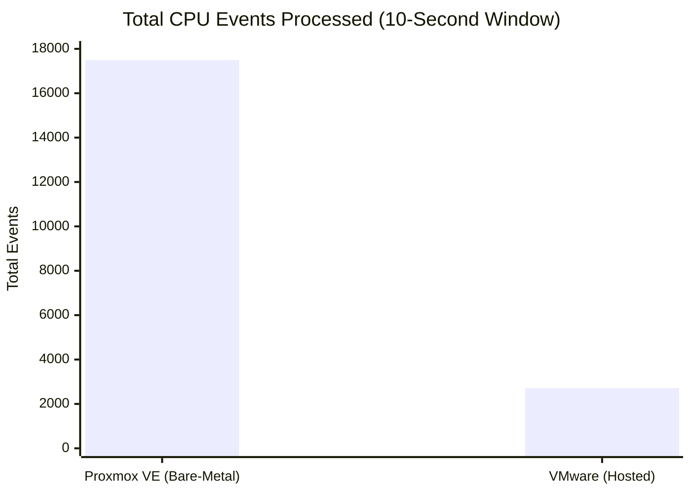
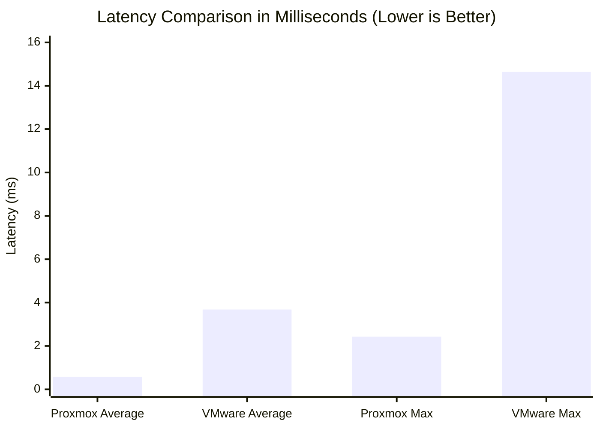

# 📊 Hypervisor Performance Analyzer

  <b>Deep-Dive Analytics: Proxmox VE vs VMware Workstation</b>

---

## 1. Raw Data Aggregation

The following data was aggregated directly from the Sysbench CPU output (`--cpu-max-prime=20000`) executed on both environments under identical virtualized hardware constraints (2 vCPU, 2GB RAM).

| Metric | Proxmox VE (Type-1) | VMware Workstation (Type-2) | Absolute Difference |
|---|---:|---:|---:|
| **Execution Time** | 10.0005 s | 10.0028 s | 0.0023 s |
| **Total Events Processed** | 17,494 | 2,713 | 14,781 |
| **Event Throughput (per sec)** | 1,749.16 | 271.14 | 1,478.02 |
| **Minimum Latency** | 0.57 ms | 2.06 ms | 1.49 ms |
| **Average Latency** | 0.57 ms | 3.68 ms | 3.11 ms |
| **Maximum Latency** | 2.43 ms | 14.64 ms | 12.21 ms |
| **95th Percentile Latency** | 0.58 ms | 5.37 ms | 4.79 ms |

---

## 2. Visual Analytics

### A. The Throughput Delta (Events Processed)

### B. The Latency Penalty

---

## 3. Mathematical Performance Ratios

To quantify the exact performance gap caused by the Type-2 host operating system overhead, we calculate the ratios between the two environments.

### 🧮 Throughput Multiplier
How much more work did the Type-1 hypervisor complete in the same amount of time?
> `Proxmox Throughput / VMware Throughput`  
> `1749.16 / 271.14 = 6.45`

**Finding:** The Type-1 hypervisor was **6.45x faster** at processing CPU calculations.

### 🧮 Latency Penalty Multiplier
How much longer did the CPU wait to process a single event on the Type-2 hypervisor?
> `VMware Average Latency / Proxmox Average Latency`  
> `3.68 / 0.57 = 6.456`

**Finding:** The Type-2 hypervisor introduced a **6.46x latency penalty** on average. At its worst (maximum latency), the penalty spiked to **6x** (14.64ms vs 2.43ms).

---

## 4. Key Takeaway: The "Execution Time" Illusion

A cursory glance at the benchmark logs shows that both tests took exactly **~10.00 seconds** to complete. To an untrained observer, the performance might look identical based on execution time alone. 

However, Sysbench's default behavior is to run for 10 seconds and report *how much work it accomplished in that time*. 
- In **10.0005s**, Proxmox computed **17,494 primes**.
- In **10.0028s**, VMware computed only **2,713 primes**.

This strongly emphasizes why **Execution Time is an invalid metric for continuous-stress benchmarking** unless the total volume of work is locked. Throughput and Latency are the true indicators of hypervisor performance.
